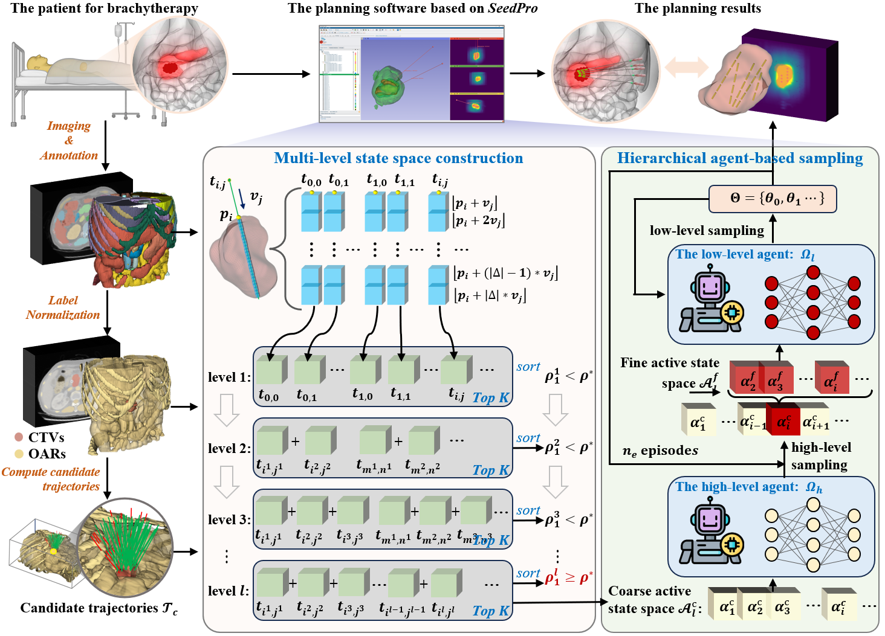
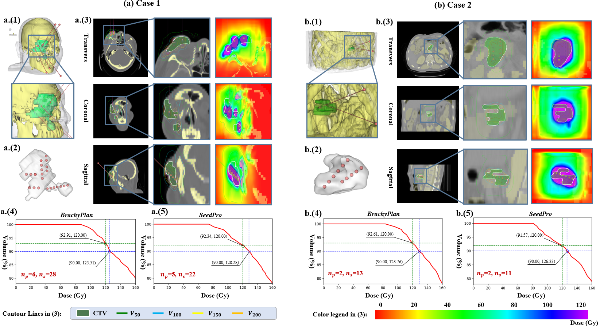

# SeedPro: Place Brachytherapy Seeds like Expert Clinicians via Hierarchical Reinforcement Agents

[](https://opensource.org/licenses/MIT)

**SeedPro** is an automatic and fine-grained preoperative planning framework for brachytherapy driven by hierarchical reinforcement learning agents. It efficiently produces expert-level treatment plans with reduced computational costs.



## Highlights

- **Expert-like Planning**: Mimics clinical decision-making through hierarchical state space construction
- **Minimized Puncture**: Prioritizes reducing needle count over seed count, following real-world clinical principles
- **SOTA Performance**: Achieves 12-20% reduction in OAR exposure and 25% fewer punctures compared to existing methods
- **High Success Rate**: 100% success rate in achieving V100 > 90% and D90 >= 120 Gy

## Method

SeedPro consists of three core components:

### 1. Multi-level State Space Construction

Constructs candidate trajectories by sampling directions within a conical region around the reference axis. The state space is hierarchically built from single-trajectory to multi-trajectory combinations, filtering by dosimetric quality at each level.

### 2. Hierarchical Reinforcement Learning

- **High-level Agent**: Selects optimal trajectory combinations from the candidate state space
- **Low-level Agent**: Performs fine-grained seed placement within selected trajectories

### 3. Segmented Adaptive Objective Function

A multi-objective reward mechanism that:
- Ensures sufficient tumor dose coverage (DVH compliance)
- Penalizes excessive dose to organs at risk (OARs)
- Encourages reduced puncture trajectories

## Project Structure

```
SeedPro/
├── main.py                 # Entry point for planning
├── config.py               # Configuration and arguments
├── core.py                 # Core planning algorithms
├── utils.py                # Utility functions
├── models.py               # Neural network models (BrachyPlanNet)
├── geometry.py             # Geometric operations
├── reinforcement.py        # Hierarchical RL implementation
├── visualizer.py           # Visualization tools
├── dose_pre/               # Dose prediction module
│   ├── myDoseNet.py        # Dose calculation network (U-Net)
│   ├── functions.py        # Dose calculation functions
│   └── predict_crop.py     # Prediction utilities
├── data/                   # Data directory (place your data here)
└── fig/                    # Figures
```

## Installation

### Prerequisites

- Python 3.8+
- CUDA-capable GPU (recommended)

### Install Dependencies

```bash
git clone https://github.com/Haitao-Lee/SeedPro.git
cd SeedPro
pip install -r requirements.txt
```

### Download Model Weights

Download the pre-trained dose calculation model and place it in `dose_pre/`:

```bash
# The dose_model.pth file should be placed at:
# dose_pre/dose_model.pth
```

## Usage

### 1. Prepare Data

Place your NIfTI files in the `data/` directory:
- CT scan: `data/pt_XXX_ct.nii.gz`
- Segmentation label: `data/pt_XXX_label.nii.gz`

### 2. Configure Parameters

Edit `config.py` to set your parameters:

```python
parser.add_argument('--case_name', default='pt_163')
parser.add_argument('--dose_image_path', default='./data/pt_163_ct.nii.gz')
parser.add_argument('--target_image_path', default='./data/pt_163_label.nii.gz')
parser.add_argument('--DVH_rate', default=0.9)  # Target coverage rate
```

### 3. Run Planning

```bash
python main.py
```

### 4. Output

Results are saved to `./output_rf/{case_name}/`:
- `seed_X_Y.stl`: 3D seed geometry files
- `dose_X_Y.nii.gz`: Dose distribution files



## Citation

If you find this work useful, please cite:

```bibtex
@article{li2026seedpro,
  title={SeedPro: Place Brachytherapy Seeds like Expert Clinicians via Hierarchical Reinforcement Agents},
  author={Li, Haitao and Liu, Jiaxuan and Huang, Wei and Wang, Zhongmin and Chen, Xiaojun},
  journal={School of Mechanical Engineering, Shanghai Jiao Tong University},
  year={2026},
  url={https://github.com/Haitao-Lee/SeedPro}
}
```

## License

This project is released under the [MIT License](LICENSE).

## Acknowledgments

This work was supported by Shanghai Jiao Tong University School of Mechanical Engineering.
